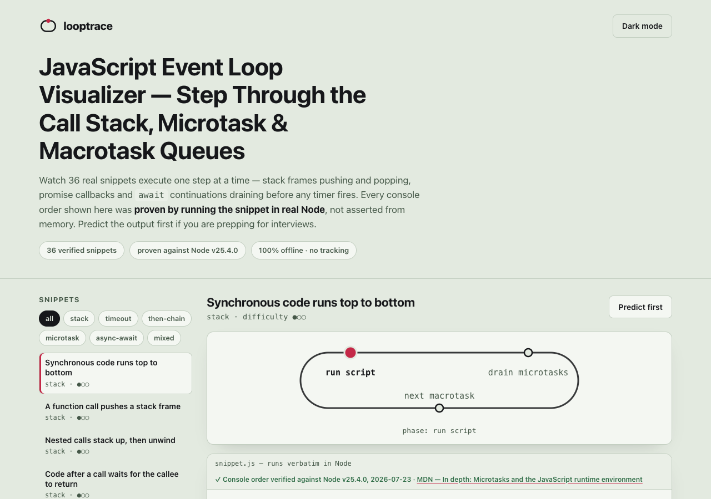

# looptrace

**JavaScript event loop visualizer — step through the call stack, microtask & macrotask queues.**
36 real snippets execute one step at a time across four live panels (call stack, microtask
queue, macrotask queue, console), with a racetrack phase dial showing where the loop is:
run script → drain microtasks → next macrotask. Every console order shown was **proven by
running the snippet verbatim in real Node** — never asserted from memory. 100% client-side,
zero dependencies, works fully offline.



## Why

Async ordering questions — *why does `setTimeout(fn, 0)` lose to `Promise.then`? when does
an `await`ed function actually resume?* — are both a daily debugging trap and the most
evergreen JavaScript interview topic. Most visualizers either predate promises entirely or
show an order the author *believes* is right. looptrace is different by construction:

- The **scheduler model** (~300 lines of plain JS) interprets each snippet over a
  whitelisted op-set and emits the step timeline and predicted console order.
- **Real Node is the referee**: `tools/verify.mjs` and the permanent test suite execute
  every snippet's code in a Node child process and require
  `real output === model prediction === stored expected order` — exactly, line for line.
- A snippet the model cannot predict is **cut, never patched by hand**.

## Features

- **36 verified snippets** grouped by topic (sync/stack basics, setTimeout, `.then` chains,
  `queueMicrotask`, async/await, mixed interview classics), difficulty-tagged and
  hash-linkable (`…/looptrace/#classic-interleave`).
- **Step player** — prev / next / autoplay / arrow keys over the model-generated timeline,
  with a plain-English caption for every step (e.g. *"await suspends f(); its continuation
  is queued as ONE microtask"*).
- **Racetrack phase dial** — a crimson tick dot advances around the loop: run script →
  drain microtasks → next macrotask.
- **Predict-first mode** — arrange the expected console lines before playback, then reveal;
  your correct-streak is stored only in localStorage. The interview-prep hook.
- **Per-snippet verified badge** — "Console order verified against Node v25.4.0,
  2026-07-23" with a WHATWG-spec / MDN / V8 citation for the rule each snippet demonstrates.
- **Export** — copy any annotated step trace as Markdown, or print a clean one-page trace.
- **Light + dark**, keyboard-operable, screen-reader-labelled, no serif fonts, no tracking.

## What it models — honest limits

- The **canonical WHATWG HTML event loop** over a whitelisted op-set only: sync
  call/return, `console.log`, `setTimeout(fn, 0)`, `Promise.resolve().then` chains,
  `queueMicrotask`, `async/await`. No DOM events, rendering steps, `requestAnimationFrame`,
  `fetch`, or workers.
- **No free-text code input, no eval** — only the 36 verified corpus snippets run. That is
  the honesty core, not a gap: it is what makes every shown order provable. looptrace is a
  teaching model, not a debugger for your own code.
- **Node-specific phases** (`process.nextTick`, `setImmediate`, timer phases) are explained
  in a labelled prose aside and **never simulated**; the whitelist refuses them rather than
  guessing.
- `setTimeout` is modelled as **0-delay FIFO ordering** only; real clock behaviour
  (clamping, throttling, nesting limits) is out of scope.
- Semantics are **modern ES2019+** (one-microtask-tick resolved `await`, per the V8/TC39
  change); pre-2019 engines ordered some await snippets differently.
- Every console order is verified against a **stated Node version on a stated date**
  (v25.4.0, 2026-07-23), cited in-app per snippet.

## Quickstart

Just open `index.html` in any modern browser — no build step, no server, no install.

- **Local:** double-click `index.html`, or run any static server in the folder.
- **Hosted:** **[Open looptrace live](https://sreenivas-sadhu-prabhakara.github.io/looptrace/)**

To re-verify the corpus yourself (Node 20+):

```sh
node tools/verify.mjs   # runs all 36 snippets in real Node, compares model + stored order
node --test             # 57 tests: fixtures, whitelist, invariants, the real-Node proof
```

## Privacy

- A strict Content-Security-Policy sets `connect-src 'none'`: the page **cannot** make any
  network request — the browser enforces it, it is not just promised.
- No external fonts, scripts, images, or analytics. Everything is self-contained.
- The only stored data is your predict-mode streak and theme choice, in your browser's
  localStorage. Nothing ever leaves your device.

## Disclaimer

looptrace is an educational visualizer provided for learning purposes only. It models the
canonical WHATWG HTML event loop over a small whitelisted op-set; it is not a debugger,
profiler, or a complete description of any engine's behaviour (Node's phase-based loop and
`process.nextTick` are explicitly not simulated). Verified console orders are tied to the
stated Node version and date; engines and specifications can change. This software is
provided under the MIT License, "as is", without warranty of any kind; the authors accept
no liability for any loss or damage arising from its use.

## License

[MIT](./LICENSE) © 2026 Sreenivas Sadhu Prabhakara
